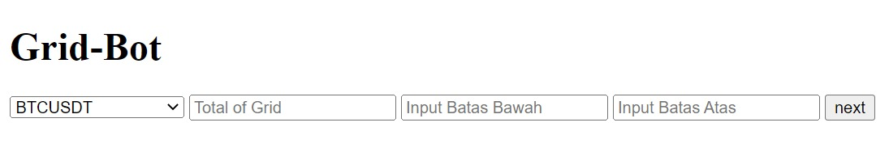
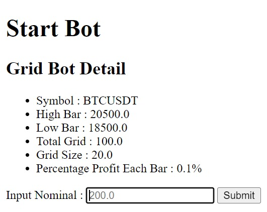

# Grid-Bot

This Algo Trading bot is created to implement the grid trading strategy into cryptocurrencies.

## Dependencies
You need to install external modules down below :

1. [Flask](https://flask.palletsprojects.com/en/2.2.x/)
2. [CCXT](https://docs.ccxt.com/en/latest/)

Install it simply using pip
```bash
pip install flask
pip install ccxt
```

## Installation
For now you can only start this bot by running the python code, by that you need to install python in your computer first

## Run Program
Before starting the program, you need to create API on your Binance account and then input it into the config.py

```python
# config.py
API_KEY = 'Your API Key Here'
API_SECURITY = 'Your API Security Here'
```

To run the program, you can simply open terminal and run your python code

```bash
C:\Users\File Location\python app.py
```

And then your terminal should look like this

```bash
 * Serving Flask app "app" (lazy loading)
 * Environment: production
   WARNING: This is a development server. Do not use it in a production deployment.
   Use a production WSGI server instead.
 * Debug mode: off
 * Running on http://127.0.0.1:5000/ (Press CTRL+C to quit)
```

And then you can open http://127.0.0.1:5000/ on your browser

It should look like this 


Then you can start choose the coin you want to trade and then input the total grid, highest bar and lowest bar. Examples look like below : 

- I want to trade BTCUSDT
- With total grid of 100 grid
- Within the range from $18000 to $20500

After that, you can click **next**



And then this page will show up, it shows the detail of the grid bot you will run and then it ask you how much you want to trade in usd. Note that there will be a minimum notional that showed up in the box, so make sure you input more than that notional, otherwise it will not run.

After filling it up, you can click **Submit**.

And After that, you can check your running trading in Binance. You can also see the progress in the terminal that you just open before.

## Credit
[Aidityas Adhakim](https://github.com/AidityasAdhakim)
